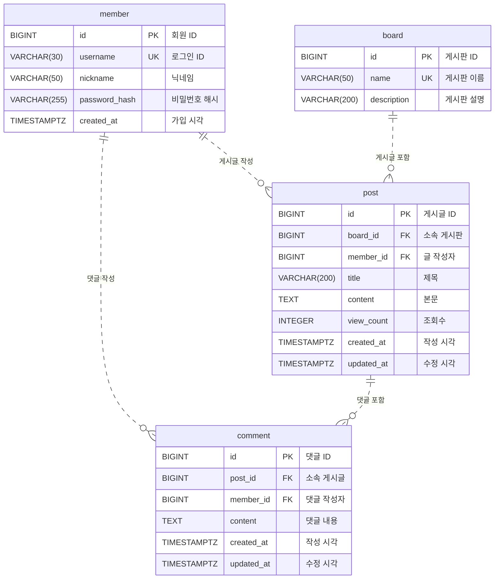

# B6-1 게시판 데이터베이스

PostgreSQL 18.6에서 회원·게시판·게시글·댓글을 구현했다. 실제 `bulletin_board`와 새 검증 DB 모두 **회원 10명·게시판 10개·글 20개·댓글 30개**, PK 4개·FK 4개를 확인했다. 쿼리 15개를 실행했고 각 DB에서 42개 검증을 통과했다. 검증일은 2026-10-09다.

기존 회원·글·댓글과 게시판 ID를 보존했다. 게시판 이름만 `자유게시판 → 자유`, `질문게시판 → 질문`으로 바꿨다. 변경 전 백업은 `/tmp/bulletin-board-before-completion-20261009.sql`에 있다.

## 파일과 실행 결과

| 파일 | 내용 |
|---|---|
| [db-comparison.md](db-comparison.md) | SQLite·MySQL·PostgreSQL·H2 비교와 선택 기준 |
| [sql/schema.sql](sql/schema.sql) | 테이블·제약조건·보조 인덱스 3개 생성 |
| [sql/seed.sql](sql/seed.sql) | 샘플 입력. FK는 생성 ID 대신 username·게시판 이름으로 찾음 |
| [sql/queries.sql](sql/queries.sql) | Q01~Q15, Q13 인덱스 생성, Q14·Q15 수정·삭제 후 롤백 |
| [results/queries.txt](results/queries.txt) | 실제 DB의 15개 SQL·설명·실행 결과와 JOIN 비교 |
| [results/constraints.txt](results/constraints.txt) | 실제 DB의 제약조건·삭제 정책·집계 등 42개 검증 |
| [results/seed.txt](results/seed.txt) | 기존 DB 보완, 샘플 입력·재입력·데이터 보존 확인 |
| [results/replay.txt](results/replay.txt) | 빈 DB에서 schema → seed → queries 재현 및 시드 재입력 확인 |
| [results/replay-constraints.txt](results/replay-constraints.txt) | 빈 DB에서 재현 후 같은 42개 검증 |
| [tests/verify.py](tests/verify.py) | 추가 패키지 없이 실행하는 검증 스크립트 |

핵심 쿼리는 기본 조회 4개(Q01~04), 조인 4개(Q05~08), 집계 3개(Q09~11), 서브쿼리 1개(Q12), 인덱스 1개(Q13), 수정·삭제 2개(Q14~15)다. 보충 JOIN 비교는 15개에 포함하지 않는다.

## 접속과 재현

현재 컨테이너는 `bulletin-board-db`, DB는 `bulletin_board`다. GUI 접속은 호스트 `127.0.0.1`, 포트 `5433`, 계정 `admin`, 비밀번호 `admin`을 사용한다. 터미널 접속:

```bash
docker exec -it bulletin-board-db psql -X -U admin -d bulletin_board
```

SQL은 프로젝트 폴더에서 다음 순서로 실행한다. **schema.sql은 빈 DB에서 한 번 실행**한다. 기존 실습 DB에 다시 실행하면 테이블 중복 오류가 나므로 재현용 DB를 새로 만든다.

```bash
docker exec bulletin-board-db createdb -U admin bulletin_board_practice
docker exec -i bulletin-board-db psql -X -U admin -d bulletin_board_practice -v ON_ERROR_STOP=1 < sql/schema.sql
docker exec -i bulletin-board-db psql -X -U admin -d bulletin_board_practice -v ON_ERROR_STOP=1 < sql/seed.sql
docker exec -i bulletin-board-db psql -X -U admin -d bulletin_board_practice -v ON_ERROR_STOP=1 < sql/queries.sql
python3 tests/verify.py bulletin_board_practice /tmp/bulletin-board-practice-check.txt
```

재현용 DB 이름이 이미 있으면 다른 이름을 사용한다. `ON_ERROR_STOP=1`은 오류 발생 시 실행을 멈춘다. schema·seed는 각각 트랜잭션으로 실행된다. queries는 조회와 인덱스를 실행하고 Q14·Q15만 트랜잭션으로 묶어 롤백한다. Q13은 인덱스를 유지한다.

seed는 이 실습 데이터를 다시 넣을 때 기존 행을 중복 추가하지 않도록 작성했다. 실습 글은 게시판·작성자·제목, 댓글은 글·작성자·내용으로 찾는다. 제목 자체에는 UNIQUE 제약이 없으므로 다른 데이터를 자유롭게 추가한 DB에 대한 범용 동기화 기능은 아니다. 검증 스크립트도 이 샘플 데이터의 예상값을 기준으로 검사한다.

이전에 실행한 독립 검증 DB `bulletin_board_verify_20261009`는 검증 후 정리했다. 기존 `bulletin_board`와 다른 컨테이너·볼륨은 유지했다. PostgreSQL의 IDENTITY는 실패하거나 롤백한 INSERT에서도 증가할 수 있으므로 ID가 연속일 필요는 없다. 기존 DB와 새 DB의 ID·가입 시각이 달라도 관계와 집계 결과는 같아야 한다.

## 설계 설명

회원·게시판·글·댓글은 각각 수정 대상과 개수가 다르므로 테이블을 나눴다. 댓글이 늘어나도 글 본문이나 작성자 정보를 반복 저장할 필요가 없다. 회원의 닉네임은 `member` 한 곳에서 수정하고 글·댓글 조회 때 JOIN으로 읽는다.

| 테이블 | 역할 | 다른 테이블과 연결 |
|---|---|---|
| member | 계정과 닉네임 | 글과 댓글의 작성자 |
| board | 주제별 게시판 | 여러 글이 소속됨 |
| post | 제목·본문·조회수 | 작성자 1명·게시판 1개에 연결 |
| comment | 댓글 내용 | 작성자 1명·글 1개에 연결 |

### ERD



관계는 양방향으로 읽는다. `member ||..o{ post`에서 글 하나의 작성자는 정확히 한 명(`||`), 회원 한 명의 글은 0개 이상(`o{`)이다. 점선 `..`은 자식이 자체 ID를 PK로 쓰는 비식별 관계다. `PK`는 기본 키, `FK`는 외래 키, `UK`는 UNIQUE 제약이다.

PK는 한 테이블에서 행을 구분하고, FK는 다른 테이블의 행을 참조한다. 실제 DB의 `test_user`는 회원 ID 1이며, 글 ID 1(첫 글)과 18(SQL 자료)의 `member_id`가 모두 1이다. 따라서 회원 한 명이 글 여러 개를 작성하는 1:N 관계다. 댓글의 `member_id`는 댓글 작성자를 뜻하므로 글 작성자와 달라도 된다. FK 네 개는 모두 NOT NULL이라 각 자식에는 부모 한 개가 반드시 있다. 부모에는 자식이 0개여도 된다.

### 타입과 규칙

타입은 ID와 FK에 BIGINT, 짧고 길이 제한이 필요한 문자열에 VARCHAR(n), 길이 상한을 정하지 않은 본문·댓글에 TEXT, 횟수인 조회수에 INTEGER를 사용했다. 가입·작성·수정은 날짜와 시각이 필요해 TIMESTAMPTZ를 선택했다. 시각 출력은 연결의 시간대를 따르며 쿼리 파일에서는 한국 시간으로 설정한다.

모든 컬럼은 NOT NULL이다. ID는 `GENERATED ALWAYS AS IDENTITY`로 생성한다. username은 UNIQUE이며 3~30자와 앞뒤 공백 금지를 적용한다. nickname은 최대 50자이며 중복을 허용한다. 게시판 이름은 최대 50자이며 UNIQUE다. description은 최대 200자, 기본값은 빈 문자열이다. 제목은 최대 200자다.

문자열은 description을 제외하고 `btrim()` 기준 빈 값·일반 공백만 있는 값을 금지한다. 탭·줄바꿈만 있는 내용까지 검사하는 규칙은 아니다. 조회수는 기본값 0이고 음수를 금지한다. 시각의 기본값은 CURRENT_TIMESTAMP이며 updated_at은 UPDATE에서 직접 갱신한다. password_hash의 최대 길이는 255자이며 빈 값 검사는 해시의 안전성을 검증하지 않는다.

### 테이블 분리와 인덱스

엑셀도 시트와 조회 함수로 데이터를 연결할 수 있다. 이번 DB에서는 UNIQUE로 중복 로그인 ID·게시판 이름을 막고, FK로 없는 회원·게시판·글 참조를 차단한다. 여러 행에 복사된 정보를 수작업으로 맞추는 대신 관계와 입력 규칙을 DB가 강제한다.

인덱스는 조회 조건에 맞췄다. `post(board_id, created_at DESC, id DESC)`는 게시판별 최신 글, `post(member_id)`는 회원별 글, `comment(post_id, created_at, id)`는 글별 댓글 목록, `comment(member_id)`는 회원별 댓글과 참조 확인에 사용한다. PK·UNIQUE 인덱스는 자동 생성되지만 FK 인덱스는 별도로 만든다. 생성과 컬럼 순서는 검증했으며, 데이터가 작으므로 속도 개선 수치는 주장하지 않는다.

## 결과로 설명하는 JOIN과 집계

같은 글·댓글 조건으로 INNER JOIN과 LEFT JOIN을 비교했다. [queries.txt](results/queries.txt)의 Q07 보충 A~C에 원본 결과가 있다.

| 글 제목 | 실제 댓글 | INNER JOIN 행 수 | LEFT JOIN 행 수 | COUNT(c.id) |
|---|---:|---:|---:|---:|
| SQL 기초 | 5 | 5 | 5 | 5 |
| Docker 실습 후기 | 0 | 0 | 1 | 0 |

INNER JOIN은 연결된 댓글이 있는 글만 남긴다. LEFT JOIN은 왼쪽의 글을 유지해 댓글 없는 글도 한 행을 남기고 댓글 컬럼에는 NULL을 표시한다. 이때 `COUNT(*)`는 남겨진 행을 1로 세지만 `COUNT(c.id)`는 NULL을 제외하므로 댓글 수 0을 얻는다.

`GROUP BY`는 같은 기준의 행을 모은 뒤 그룹마다 계산한다. Q09는 회원별로 글 ID를 세어 `user02`는 3건, `user09`·`user10`은 0건이다. Q10은 게시판별 조회수 합계다. 자유 게시판의 세 글은 0·10·20이므로 SUM은 30이다. 글 없는 건의 게시판은 SUM이 NULL이 되어 `COALESCE(..., 0)`으로 0을 표시한다.

Q11은 글이 있는 게시판의 평균이다. 자유의 평균은 `(0 + 10 + 20) / 3 = 10.00`, 자료의 평균은 `(250 + 180) / 2 = 215.00`이다. 조회수 0인 글도 평균의 분모에 포함하고, 글 없는 건의는 제외한다. 글 조회수를 합산할 때 댓글을 함께 JOIN하면 같은 글의 조회수가 댓글 개수만큼 반복될 수 있어 Q10·Q11에는 댓글 테이블을 연결하지 않았다.

Q12는 먼저 서브쿼리에서 전체 평균 `1580 / 20 = 79`를 구한다. 바깥 SELECT는 조회수가 79보다 큰 글 9개를 반환한다. Q14의 `UPDATE 1`, Q15의 `DELETE 1`과 RETURNING 결과는 각각 한 행이 변경되었음을 보여준다. 마지막 ROLLBACK과 전체 행 비교로 원본 복원을 확인했다.

## 복잡한 쿼리 풀이: Q07

댓글이 없는 글도 0으로 보여줘야 하므로 Q07을 풀이 대상으로 선택했다.

```sql
SELECT p.id, p.title, COUNT(c.id) AS comment_count
FROM post p LEFT JOIN comment c ON c.post_id = p.id
GROUP BY p.id, p.title
ORDER BY p.id;
```

1. 글을 모두 남기려면 기준 테이블을 `post`로 잡는다.
2. `comment.post_id = post.id`로 댓글을 연결하고 LEFT JOIN을 선택한다.
3. SQL 기초는 연결된 댓글 5개로 중간 결과가 5행이 된다. Docker 실습 후기는 댓글 ID가 NULL인 1행이 된다.
4. `GROUP BY p.id, p.title`로 글마다 하나의 그룹으로 묶는다. 제목이 같은 다른 글도 ID가 달라 별도 그룹이 된다.
5. `COUNT(c.id)`로 NULL을 빼고 댓글 ID를 센다. 결과는 각각 5와 0이다. 전체 글 20개가 유지되고, 댓글 없는 글 4개가 모두 0으로 표시되는지 검증했다.

## 실제 오류와 해결 기록

실습 중 컬럼 정의인 `board_id BIGINT NOT NULL` 부분부터 실행했을 때 `ERROR: syntax error at or near "board_id"`가 발생했다. 컬럼 정의는 단독 SQL이 아니라 `CREATE TABLE post (...)`의 내부 문법이다. `CREATE TABLE`부터 닫는 괄호·세미콜론까지 전체 문장을 실행해야 한다. 완성된 문장은 [schema.sql](sql/schema.sql)에 있으며 빈 DB에서 파일 전체 실행과 FK 네 개 생성을 확인했다. SQL 실행 전 선택한 범위가 완전한 문장인지 확인하면 같은 문제를 피할 수 있다.

이번 자동 검증에서는 RESTRICT 삭제 오류도 실제로 확인했다. 이 PostgreSQL 18.6에서는 없는 부모를 참조하는 입력 오류가 SQLSTATE `23503`, RESTRICT로 부모 삭제를 막는 오류가 `23001`이었다. 검증의 예상값을 실제 삭제 정책과 오류에 맞춘 뒤 두 DB에서 모두 통과했다. [constraints.txt](results/constraints.txt)에 실패 SQL과 DB 오류 원문을 남겼다.

회원·게시판에 작성물이 있으면 RESTRICT로 삭제를 막는다. 글을 삭제하면 연결된 댓글만 CASCADE로 지운다. 첫 글 삭제 테스트에서는 글 20→19, 댓글 30→27, 회원·게시판은 각각 10 그대로였고 롤백 후 모두 복원됐다. 댓글 한 개 삭제는 글을 삭제하지 않는다.

## 확인 범위

B6-1 필수 SQL·샘플·결과·설명 자료를 작성하고 로컬 DB에서 검증했다. 체크리스트의 구현 5개는 실제 결과로 완료 표시했다. 설명·회고 10개에는 자료를 연결했으며, 학습자가 직접 설명할 수 있는지는 본인이 확인하도록 남겼다.

비밀번호 해시는 학습용 표시 문자열이다. 실제 로그인·권한 검사·백엔드·화면과 외부 배포는 이 미션에 포함하지 않았다. `admin/admin`은 localhost에 바인딩한 실습 DB의 접속 정보다. ERD는 이 README의 Mermaid 관계도로 제공한다. 미션 PDF·체크리스트 B6-1.md·개인 계획 plan.md·로컬 환경 설정·임시 파일은 .gitignore로 제외하고, SQL·결과·비교 문서는 Git에 포함할 수 있다.
